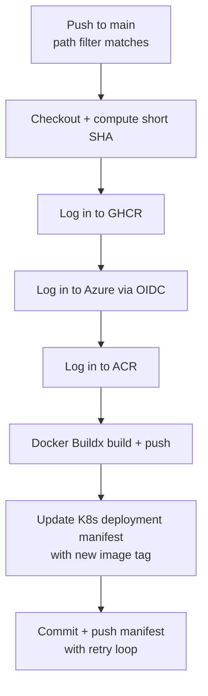
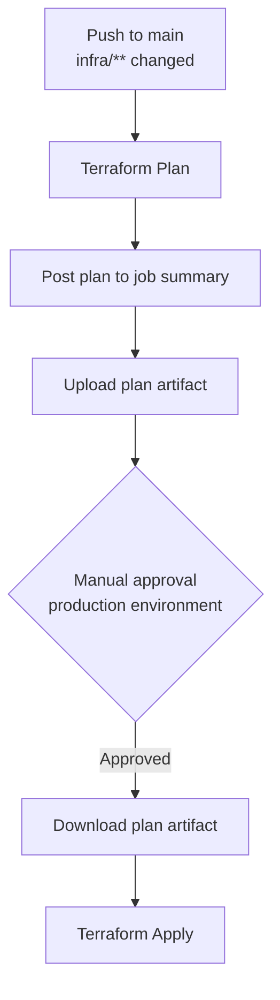

This platform uses GitHub Actions for all CI/CD. There are eight workflows in total — seven site deployment workflows and one infrastructure workflow. All workflow files live in `.github/workflows/`.

## Design Principles

Every workflow in this repository follows a consistent set of conventions:

- **Path-filtered triggers.** Each workflow only runs when files in its relevant directory change on `main`, avoiding unnecessary builds.
- **Pinned action versions.** All third-party actions are pinned to full commit SHAs rather than tags, preventing supply-chain attacks from tag mutation.
- **OIDC authentication.** Azure credentials are never stored as secrets. GitHub Actions authenticates via OpenID Connect federated identity, configured in the `github-oidc` Terraform module.
- **Concurrency control.** Each deploy workflow uses a concurrency group with `cancel-in-progress: false`, ensuring in-flight deployments complete before the next one starts.
- **Manual dispatch.** All deploy workflows support `workflow_dispatch` for manual reruns without requiring a code change.

## Site Deployment Workflows

All seven sites share an identical deployment pattern. The only differences between them are the path filter, Dockerfile location, image name, and manifest path.

### Shared Pipeline

### Step-by-Step Breakdown

#### Checkout and compute short SHA

The repository is checked out and the short commit SHA is captured. This SHA becomes the Docker image tag, providing a direct link between every running container and the commit that produced it.

#### Authenticate to registries

Three logins happen in sequence:

- **GHCR** — using the built-in `GITHUB_TOKEN`
- **Azure** — via OIDC (`azure/login` with `client-id`, `tenant-id`, `subscription-id`)
- **ACR** — using the Azure CLI session established in the previous step

#### Docker build and push

Each image is built with Docker Buildx (enabling build cache via GitHub Actions cache) and pushed with four tags:

| Tag | Registry | Purpose |
|-----|----------|---------|
| `<sha>` | GHCR | Immutable version reference |
| `latest` | GHCR | Convenience for local development |
| `<sha>` | ACR | Production deployment (K8s pulls from here) |
| `latest` | ACR | Rollback convenience |

The `COMMIT_SHA` build arg is passed so the application can embed its version at build time.

#### Update Kubernetes manifest

The workflow uses `sed` to replace the image tag in `k8s/<site>/deployment.yaml` with the new ACR-tagged image. This is the GitOps trigger — when Flux CD sees this change, it reconciles the cluster.

#### Commit and push with retry

The manifest change is committed as `[deploy] <site>: <sha>` and pushed to `main`. A retry loop (5 attempts with exponential backoff) handles race conditions when multiple site workflows push concurrently. Each attempt does a `git pull --rebase` before pushing.

### Workflow Inventory

| Workflow | File | Trigger Path | Site |
|----------|------|--------------|------|
| Build and Deploy | `deploy.yml` | `sites/kevinryan-io/**` | kevinryan.io |
| Build and Deploy Brand | `deploy-brand.yml` | `sites/brand-kevinryan-io/**` | brand.kevinryan.io |
| Build and Deploy Docs | `deploy-docs.yml` | `sites/docs-kevinryan-io/**` or `docs/**` | docs.kevinryan.io |
| Build and Deploy AI-Immigrants | `deploy-aiimmigrants.yml` | `sites/aiimmigrants-com/**` | aiimmigrants.com |
| Build and Deploy SpecMCP | `deploy-specmcp.yml` | `sites/specmcp-ai/**` | specmcp.ai |
| Build and Deploy SDD Book | `deploy-sddbook.yml` | `sites/sddbook-com/**` | sddbook.com |
| Build and Deploy Distributed Equity | `deploy-distributedequity.yml` | `sites/distributedequity-org/**` | distributedequity.org |

The docs workflow is the only one with two trigger paths — changes to either the site source (`sites/docs-kevinryan-io/**`) or the shared documentation content (`docs/**`) will trigger a rebuild, since the docs site symlinks content from the `docs/` directory.

### Permissions

Every deploy workflow requests three permission scopes:

| Permission | Reason |
|------------|--------|
| `contents: write` | Commit the updated K8s manifest back to `main` |
| `packages: write` | Push Docker images to GHCR |
| `id-token: write` | Request an OIDC token for Azure authentication |

## Terraform Workflow

The infrastructure workflow (`terraform.yml`) manages all Azure and Cloudflare resources. It follows a plan/approve/apply pattern with environment protection.

### Pipeline

### Plan Job

Triggered on any push to `main` that changes files under `infra/`:

1. Checkout the repository
2. Set up Terraform CLI
3. Authenticate to Azure via OIDC
4. Run `terraform init` and `terraform plan -out=tfplan`
5. Post the plan output to the GitHub Actions job summary for review
6. Upload the plan file as an artifact for the apply job

### Apply Job

Runs only after the plan job completes **and** a reviewer approves in the `production` GitHub environment:

1. Checkout the repository
2. Set up Terraform and authenticate to Azure
3. Download the plan artifact from the plan job
4. Run `terraform apply tfplan` using the exact plan that was reviewed

This two-stage approach ensures no infrastructure changes are applied without human review, while still keeping the plan deterministic — the same plan file produced during review is the one applied.

### Permissions

| Permission | Reason |
|------------|--------|
| `contents: read` | Read the Terraform configuration |
| `id-token: write` | Request an OIDC token for Azure authentication |

Note that the Terraform workflow only needs `contents: read` (not `write`) since it does not commit anything back to the repository.

### Secrets and Variables

The Terraform workflow passes several secrets as environment variables:

| Variable | Source |
|----------|--------|
| `ARM_CLIENT_ID` / `ARM_TENANT_ID` / `ARM_SUBSCRIPTION_ID` | Azure OIDC identity |
| `TF_VAR_cloudflare_api_token` | Cloudflare API access |
| `TF_VAR_admin_ssh_public_key` | SSH key for VM access |
| `TF_VAR_admin_ip` | IP allowlist for NSG rules |
| `TF_VAR_cloudflare_zone_id` | Cloudflare DNS zone |
| `TF_VAR_acr_name` | Azure Container Registry name |
| `TF_VAR_github_token` | Flux CD GitHub access |

## Security Considerations

- **No long-lived credentials.** Azure authentication uses OIDC federated identity throughout. No client secrets are stored in GitHub.
- **Pinned actions.** Every `uses:` reference is pinned to a full commit SHA with a version comment, preventing compromised tags from injecting malicious code.
- **Least privilege.** Each workflow requests only the permissions it needs. Deploy workflows need write access; Terraform only needs read.
- **Environment protection.** Terraform apply requires manual approval via GitHub's `production` environment, preventing accidental infrastructure changes.
- **Concurrency groups.** Prevent parallel deployments to the same site from creating race conditions in the cluster.

## Adding a New Site Workflow

To add a deployment workflow for a new site:

1. Copy any existing `deploy-*.yml` file
2. Update the `name`, `paths` filter, concurrency `group`, Dockerfile `file` path, image name in `tags`, and the `sed` command to target the correct manifest
3. Ensure the site has a `Dockerfile` and corresponding `k8s/<site>/deployment.yaml`
4. The new workflow will trigger on the next push to `main` that changes files in the site's directory
