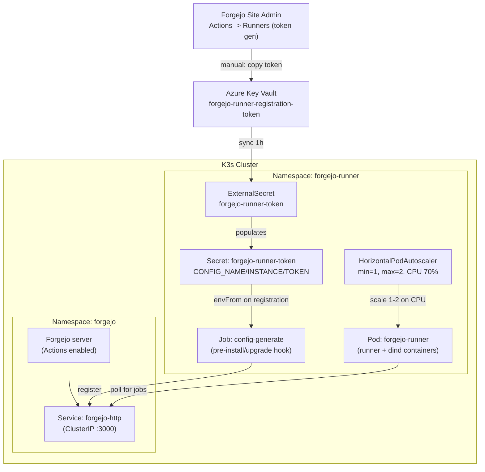

[Forgejo Actions](https://forgejo.org/docs/latest/user/actions/) is Forgejo's CI system, GitHub-Actions-syntax-compatible. Workflows defined in `.forgejo/workflows/*.yml` are executed by `act_runner` daemons that poll the Forgejo instance for queued jobs. This page covers the deployment of those runners on the K3s cluster, where they live in the `forgejo-runner` namespace alongside the Forgejo server itself.

## Architecture



## Helm Chart

Deployed via the [WrenIX forgejo-runner Helm chart](https://codeberg.org/wrenix/helm-charts/src/branch/main/charts/forgejo-runner) (OCI registry at `oci://codeberg.org/wrenix/helm-charts`). The Forgejo project itself does not publish an official Helm chart for the runner; WrenIX is the de-facto standard with 115+ released versions and active maintenance.

```yaml
apiVersion: source.toolkit.fluxcd.io/v1
kind: HelmRepository
metadata:
  name: forgejo-runner
  namespace: forgejo-runner
spec:
  type: oci
  url: oci://codeberg.org/wrenix/helm-charts
  interval: 1h
```

Chart version is pinned to `0.7.4` in `helmrelease.yaml`. The chart deploys a single `Deployment` whose pod contains two containers — the `runner` (running `forgejo-runner daemon`) and a `dind` sidecar (running `docker:29.3.0-dind` with TLS) — sharing a `docker-certs` `emptyDir` volume so the runner can talk to the Docker daemon over `tcp://127.0.0.1:2376` with mutual TLS.

## Registration flow

The chart's pre-install/upgrade hook runs a `Job` that reads `CONFIG_NAME`, `CONFIG_INSTANCE`, and `CONFIG_TOKEN` from a Kubernetes secret, calls `forgejo-runner register`, and patches the registered runner config back into a long-lived secret named `forgejo-runner-config`. The actual `Deployment` then starts and uses that registered config to authenticate against Forgejo.

```yaml
apiVersion: external-secrets.io/v1
kind: ExternalSecret
metadata:
  name: forgejo-runner-token
  namespace: forgejo-runner
spec:
  refreshInterval: 1h
  secretStoreRef:
    kind: ClusterSecretStore
    name: azure-keyvault
  target:
    name: forgejo-runner-token
    creationPolicy: Owner
    template:
      engineVersion: v2
      data:
        CONFIG_NAME: "forgejo-runner"
        CONFIG_INSTANCE: "http://forgejo-http.forgejo.svc.cluster.local:3000"
        CONFIG_TOKEN: "{{ .registration_token }}"
  data:
    - secretKey: registration_token
      remoteRef:
        key: forgejo-runner-registration-token
```

Key configuration decisions:

- **Reusable registration token** — Forgejo's site-admin-level tokens can register multiple runners with the same value. Generated once via Site Administration -> Actions -> Runners -> "Create new runner", stored in Azure Key Vault, and synced via ESO. Re-registers on every pod start; the chart's `helm.sh/resource-policy: keep` annotation on the `forgejo-runner-config` secret means subsequent pod restarts skip re-registration if a `.runner` config already exists.
- **In-cluster Forgejo address** — `CONFIG_INSTANCE` points at the in-cluster Service rather than `https://git.kevinryan.io` to avoid hairpinning out through Cloudflare and back. Saves egress, avoids TLS overhead, and keeps runner traffic on the cluster network.
- **Templated environment-variable secret** — The chart's `existingInitSecret` mode requires the three `CONFIG_*` keys as environment variables. ESO's `template` block constructs them at sync time, with only the token coming from Key Vault.

## Runner Configuration

```yaml
runner:
  config:
    create: true
    existingInitSecret: forgejo-runner-token
    file:
      runner:
        capacity: 1
        labels:
          - "ubuntu-latest:docker://node:20-bookworm"
          - "ubuntu-22.04:docker://node:20-bookworm"
          - "docker:docker://node:20-bookworm"
```

- **`capacity: 1`** — each runner pod executes one job at a time. Concurrency comes from horizontal scaling (HPA), not vertical.
- **Labels** — define which workflow `runs-on:` values this runner will accept. `ubuntu-latest` and `ubuntu-22.04` are mapped to a Node 20 image since most workflows assume Node is preinstalled. Adjust the image tag when projects need a different language toolchain.

## Autoscaling

```yaml
autoscaling:
  enabled: true
  minReplicas: 1
  maxReplicas: 2
  targetCPUUtilizationPercentage: 70
  behavior:
    scaleDown:
      stabilizationWindowSeconds: 300
    scaleUp:
      stabilizationWindowSeconds: 0
```

The chart renders an `autoscaling/v2` `HorizontalPodAutoscaler` against the runner `Deployment`. Scaling is **CPU-based**, not queue-depth-aware — when a queued job is picked up by the existing runner and CPU usage rises above 70% sustained, HPA scales out to a second replica. When the job finishes and CPU drops, the second replica is removed after a 5-minute stabilisation window.

This means short jobs may not trigger scale-up (the workload is gone before HPA observes high CPU). For a small admin-driven setup this is acceptable. For queue-depth-aware autoscaling, an alternative would be a custom `KEDA ScaledObject` watching Forgejo's API.

## Docker-in-Docker

The chart bundles a `dind` sidecar container by default; we do not need to add one manually. The pod-level `securityContext.privileged: true` is required for Docker daemon to run inside the pod, which is why the `forgejo-runner` namespace is labelled with `pod-security.kubernetes.io/enforce: privileged`.

| Concern | Mitigation |
|--------|------------|
| Privileged container in cluster | Confined to `forgejo-runner` namespace; no other workloads scheduled there |
| Compromise of build job -> host | Single-tenant cluster (no untrusted user code); admin-controlled repo set |
| Cache between builds | Not configured — each job starts with a fresh Docker daemon |

The runner container connects to the daemon at `tcp://127.0.0.1:2376` with TLS verification enabled (`DOCKER_TLS_VERIFY=1`); shared certs live in a per-pod `emptyDir`.

### Docker MTU override

The dind sidecar starts `dockerd` inside the runner pod, which creates a `docker0` bridge with the default MTU of 1500. Every job container's `eth0` inherits that MTU. On Azure CNI overlay (and most VXLAN- or WireGuard-based pod networks) the underlying pod interface has a smaller effective MTU because of tunnel headers, so 1500-byte frames from the job container fragment or get black-holed. The classic symptom is `pip install` / `apt-get update` / `npm install` hanging mid-stream during a TLS handshake or a large package download with no obvious error.

The fix is to lower `dockerd`'s bridge MTU. The WrenIX chart does not expose `args` for the dind container, but it does pass through pod-level `volumes` and `volumeMounts` — and looking at the chart's `templates/deployment.yaml`, the top-level `volumeMounts` value is wired onto the dind container only. We mount a small `ConfigMap` (`forgejo-runner-dind-daemon-config`) at `/etc/docker/daemon.json`:

```json
{
  "mtu": 1400,
  "default-network-opts": {
    "bridge": {
      "com.docker.network.driver.mtu": "1400"
    }
  }
}
```

Both keys are intentional and **not** redundant.
Per the [Docker daemon reference](https://docs.docker.com/reference/cli/dockerd/#default-network-options),
`mtu` only applies to the built-in `docker0` bridge,
while `default-network-opts.bridge.com.docker.network.driver.mtu` applies to every **new** user-created bridge network.
The Forgejo runner creates one user-defined bridge network **per job**
(because `runner.config.file.container.network: ""` in the WrenIX defaults),
so without the `default-network-opts` block, job containers' `eth0` stays at 1500 even though `docker0` is 1400
— the precise failure mode we hit on first deploy.

Verification from inside a running job's container:

```bash
ip link show eth0   # expect: ... mtu 1400 ...
```

1400 is a safe first guess for Azure CNI overlay. Drop to 1380 for WireGuard/Calico or 1280 for Tailscale / IPv6 minimum if the symptom persists. The `daemon.json` file is mounted with `subPath` so the rest of `/etc/docker/` remains writable for the entrypoint. Changes to the ConfigMap do not roll the pod automatically; after editing, run `kubectl rollout restart deploy/forgejo-runner -n forgejo-runner`.

## Resource Requests and Limits

```yaml
resources:
  requests:
    cpu: 100m
    memory: 256Mi
  limits:
    cpu: 500m
    memory: 512Mi
dind:
  resources:
    requests:
      cpu: 200m
      memory: 512Mi
    limits:
      cpu: 1000m
      memory: 2Gi
```

Per-pod totals at limit: 1500m CPU, 2.5 GiB RAM. At max replicas (2), the deployment can consume up to 3000m CPU and 5 GiB RAM. Idle (1 replica), the requests are 300m CPU and 768 MiB RAM.

## Capacity caveat

The K3s cluster runs on 2 x `Standard_B2s` Azure VMs (~4 vCPU / 8 GiB raw, less allocatable after K3s overhead). With Forgejo, PostgreSQL traffic, observability stack, multiple Next.js / Astro sites, HQ, Directus, and now the runner, sustained CI load may cause scheduling pressure or memory eviction.

Mitigations to consider as a follow-up effort:

- Add a third `Standard_B2s` (or `B2ms` for double RAM) node, taint it `runners=true:NoSchedule`, and add a corresponding `tolerations` block to the runner pods so they only land there.
- Resize existing nodes from `B2s` (4 GiB) to `B2ms` (8 GiB) to double cluster RAM.
- Cap `autoscaling.maxReplicas: 1` until capacity is added.

## Flux CD Integration

The Forgejo runner `Kustomization` declares two `dependsOn` entries: `external-secrets-store` (so ESO is reconciling) and `forgejo` (so the Forgejo server is up before runners try to register).

```yaml
apiVersion: kustomize.toolkit.fluxcd.io/v1
kind: Kustomization
metadata:
  name: forgejo-runner
  namespace: flux-system
spec:
  dependsOn:
    - name: external-secrets-store
    - name: forgejo
  interval: 10m0s
  path: ./k8s/forgejo-runner
  prune: true
  sourceRef:
    kind: GitRepository
    name: flux-system
```

If the registration token is missing or invalid, the chart's pre-install Job fails, the HelmRelease enters a `Failed` state, and Flux retries up to 5 times. To recover, regenerate the token in Forgejo Site Admin, update the Key Vault secret, wait for ESO to refresh (or force with `kubectl annotate externalsecret forgejo-runner-token force-sync=$(date +%s) --overwrite -n forgejo-runner`), and reconcile the HelmRelease.

## Post-Deployment Notes

- **Verify registration**: log in to Forgejo as admin and visit Site Administration -> Actions -> Runners. The runner should appear in the list with status "online" within ~1-2 minutes of pod startup.
- **First job test**: create a `.forgejo/workflows/test.yml` in any repo with `runs-on: ubuntu-latest` and a single `run: echo hello`. The job should pick up immediately if the runner is idle.
- **Updating the chart version**: bump the `version:` field in `k8s/forgejo-runner/helmrelease.yaml` and let Flux reconcile. The chart's `helm.sh/resource-policy: keep` on the long-lived config secret means the runner survives upgrades without re-registering.
- **Rotating the registration token**: regenerate via the admin UI, update the Key Vault secret (terraform apply with new tfvar value, or `az keyvault secret set` directly for a one-off), force ESO refresh. Existing registered runners keep working until pod restart since they use the long-lived `.runner` config; only fresh registrations need the new token.
