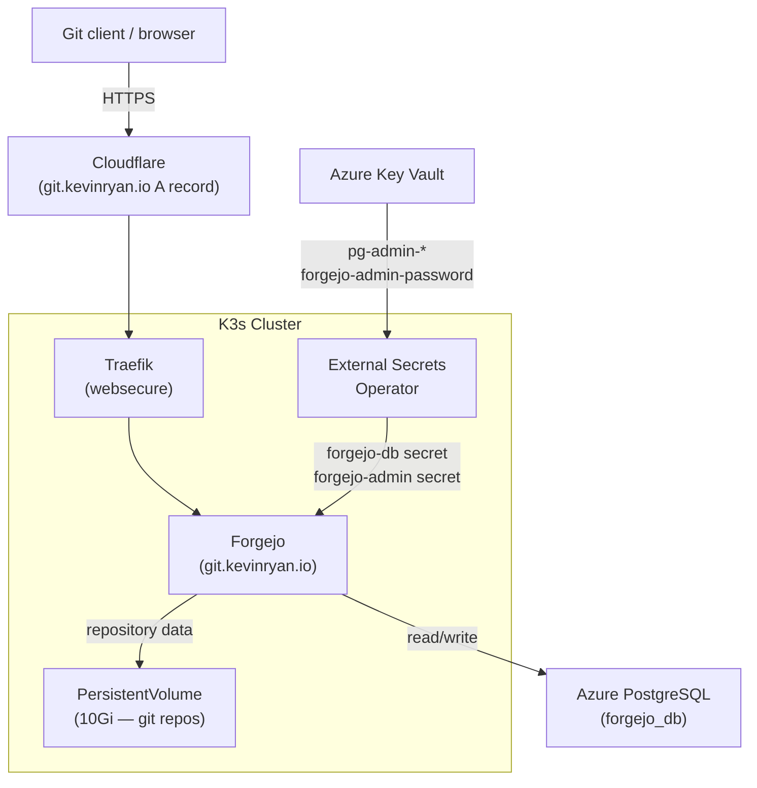

<a href="https://forgejo.org/" target="_blank" rel="noopener noreferrer">Forgejo</a> is a self-hosted, lightweight Git hosting service. It is deployed on the K3s cluster as a Helm-managed workload, accessible at <a href="https://git.kevinryan.io" target="_blank" rel="noopener noreferrer">git.kevinryan.io</a>. All repository data is stored on a persistent volume, and database credentials are sourced from Azure Key Vault via the External Secrets Operator.

## Architecture



## Kubernetes Deployment

Forgejo is deployed via the [forgejo-contrib Helm chart](https://codeberg.org/forgejo-contrib/forgejo-helm) (OCI registry at `oci://codeberg.org/forgejo-contrib`), managed by Flux CD. All manifests live under `k8s/forgejo/`.

### Namespace

```yaml
apiVersion: v1
kind: Namespace
metadata:
  name: forgejo
```

### Helm Repository

The chart is served as an OCI artifact from Codeberg. The `HelmRepository` uses `type: oci` to address the registry directly — no index URL needed.

```yaml
apiVersion: source.toolkit.fluxcd.io/v1
kind: HelmRepository
metadata:
  name: forgejo
  namespace: forgejo
spec:
  type: oci
  url: oci://codeberg.org/forgejo-contrib
  interval: 1h
```

### Helm Release

```yaml
apiVersion: helm.toolkit.fluxcd.io/v2
kind: HelmRelease
metadata:
  name: forgejo
  namespace: forgejo
spec:
  interval: 1h
  chart:
    spec:
      chart: forgejo
      version: "16.2.1"
      sourceRef:
        kind: HelmRepository
        name: forgejo
        namespace: forgejo
      interval: 1h
  install:
    remediation:
      retries: 5
  upgrade:
    remediation:
      retries: 5
  values:
    postgresql:
      enabled: false
    postgresql-ha:
      enabled: false
    persistence:
      enabled: true
      size: 10Gi
    gitea:
      admin:
        existingSecret: forgejo-admin
      config:
        server:
          DOMAIN: git.kevinryan.io
          ROOT_URL: https://git.kevinryan.io
          HTTP_PORT: 3000
        database:
          DB_TYPE: postgres
          NAME: forgejo_db
          SSL_MODE: require
      additionalConfigFromEnvs:
        - name: FORGEJO__DATABASE__HOST
          valueFrom:
            secretKeyRef:
              name: forgejo-db
              key: db_host
        - name: FORGEJO__DATABASE__USER
          valueFrom:
            secretKeyRef:
              name: forgejo-db
              key: db_user
        - name: FORGEJO__DATABASE__PASSWD
          valueFrom:
            secretKeyRef:
              name: forgejo-db
              key: db_password
```

Key configuration decisions:

- **Built-in databases disabled** — `postgresql.enabled: false` and `postgresql-ha.enabled: false` prevent the chart from deploying its own PostgreSQL sidecars. The external Azure PostgreSQL instance is used instead.
- **Persistence enabled** — A 10Gi `PersistentVolumeClaim` is created for the Forgejo data directory. Without this, all git repository data would be lost on pod restart.
- **`ROOT_URL` set explicitly** — Required for Forgejo to generate correct clone URLs and redirect links. Without it, Forgejo infers the URL from the incoming request, which can break behind a reverse proxy.
- **DB credentials via env vars** — Sensitive values (host, user, password) are injected at runtime from the `forgejo-db` Kubernetes secret using `FORGEJO__DATABASE__*` environment variables, which Forgejo reads directly into its `app.ini` configuration.
- **Admin secret** — The `gitea.admin.existingSecret` field points to the `forgejo-admin` secret, which provides `username`, `email`, and `password` keys for the initial admin account.

### Ingress

Traefik routes `git.kevinryan.io` to the Forgejo HTTP service on port 3000:

```yaml
apiVersion: traefik.io/v1alpha1
kind: IngressRoute
metadata:
  name: forgejo
  namespace: forgejo
spec:
  entryPoints:
    - websecure
  routes:
    - match: Host(`git.kevinryan.io`)
      kind: Rule
      services:
        - name: forgejo-http
          port: 3000
  tls: {}
```

TLS termination is handled by Traefik using the cluster-wide certificate configuration (same pattern as all other services).

## Secrets Management

Two `ExternalSecret` resources pull credentials from Azure Key Vault via the `azure-keyvault` `ClusterSecretStore`.

### Database credentials (`forgejo-db`)

```yaml
apiVersion: external-secrets.io/v1
kind: ExternalSecret
metadata:
  name: forgejo-db
  namespace: forgejo
spec:
  refreshInterval: 1h
  secretStoreRef:
    kind: ClusterSecretStore
    name: azure-keyvault
  target:
    name: forgejo-db
    creationPolicy: Owner
  data:
    - secretKey: db_host
      remoteRef:
        key: pg-fqdn
    - secretKey: db_user
      remoteRef:
        key: pg-admin-username
    - secretKey: db_password
      remoteRef:
        key: pg-admin-password
```

The three keys are consumed by the `HelmRelease` via `additionalConfigFromEnvs` — each maps to a `FORGEJO__DATABASE__*` environment variable that Forgejo applies to its running configuration.

### Admin credentials (`forgejo-admin`)

```yaml
apiVersion: external-secrets.io/v1
kind: ExternalSecret
metadata:
  name: forgejo-admin
  namespace: forgejo
spec:
  refreshInterval: 1h
  secretStoreRef:
    kind: ClusterSecretStore
    name: azure-keyvault
  target:
    name: forgejo-admin
    creationPolicy: Owner
    template:
      engineVersion: v2
      data:
        username: "forgejo-admin"
        email: "admin@git.kevinryan.io"
        password: "{{ .forgejo_admin_password }}"
  data:
    - secretKey: forgejo_admin_password
      remoteRef:
        key: forgejo-admin-password
```

The admin username and email are hardcoded in the template; only the password is stored in Key Vault. The `forgejo-admin-password` secret is generated by Terraform using a `random_password` resource and stored in Key Vault on `terraform apply`.

## Database

Forgejo stores all data in a dedicated database on the shared Azure PostgreSQL Flexible Server:

| Setting | Value |
|---------|-------|
| Database name | `forgejo_db` |
| Server | Azure PostgreSQL Flexible Server (v16), `psql-kevinryan-io` |
| SSL | Required (`sslmode=require`) |
| Network | Private subnet, no public access |
| Provisioned by | Terraform (`infra/main.tf` — `module.postgresql.databases`) |

## Flux CD Integration

The Forgejo `Kustomization` declares a `dependsOn` on `external-secrets-store`, ensuring the `ClusterSecretStore` (and therefore Azure Key Vault access) is available before Forgejo's `ExternalSecret` resources are reconciled.

```yaml
apiVersion: kustomize.toolkit.fluxcd.io/v1
kind: Kustomization
metadata:
  name: forgejo
  namespace: flux-system
spec:
  dependsOn:
    - name: external-secrets-store
  interval: 10m0s
  path: ./k8s/forgejo
  prune: true
  sourceRef:
    kind: GitRepository
    name: flux-system
```

The `HelmRelease` is reconciled by the Flux `helm-controller`. On first deployment, the controller pulls the chart from `oci://codeberg.org/forgejo-contrib/forgejo:16.2.1`, creates the `PersistentVolumeClaim`, and waits for the `forgejo-db` and `forgejo-admin` secrets to be populated by ESO before the pod starts.

## DNS

The `git.kevinryan.io` A record is managed by Terraform as a standalone resource — it is intentionally **not** included in the `cloudflare` module's `subdomains` list. The module's `subdomains` list feeds a Cloudflare cache ruleset that caches all traffic for 24 hours, which would break git push/pull/clone operations.

```hcl
resource "cloudflare_record" "git" {
  zone_id = var.cloudflare_zone_id
  name    = "git"
  content = module.network.public_ip_address
  type    = "A"
  proxied = true
  ttl     = 1
}
```

Traffic is proxied through Cloudflare for DDoS protection, but no caching rules apply to `git.kevinryan.io`.

## Post-Deployment Notes

- **SSH access is not configured.** Only HTTPS git operations are available. A `LoadBalancer` service on port 22 can be added if SSH-based git is needed.
- **`SECRET_KEY` and `INTERNAL_TOKEN`** are auto-generated by the Forgejo chart on first install and stored in a Kubernetes Secret. They survive pod restarts but are lost on chart uninstall. If full reproducibility is required, these should be generated once and stored in Key Vault.
- **After adding `forgejo_db`** to the Terraform PostgreSQL module's `databases` list, `terraform apply` must be run before the Helm release will reconcile — Forgejo's migrations will fail if the database does not exist.
