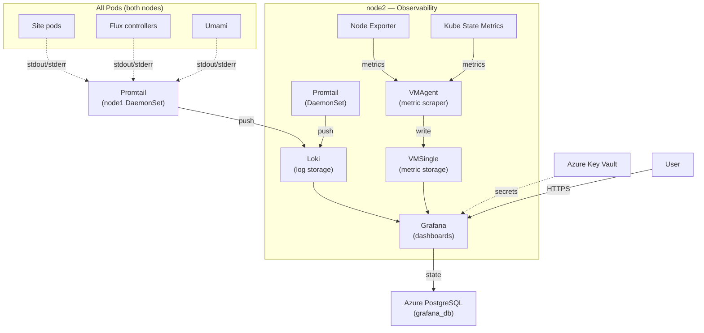
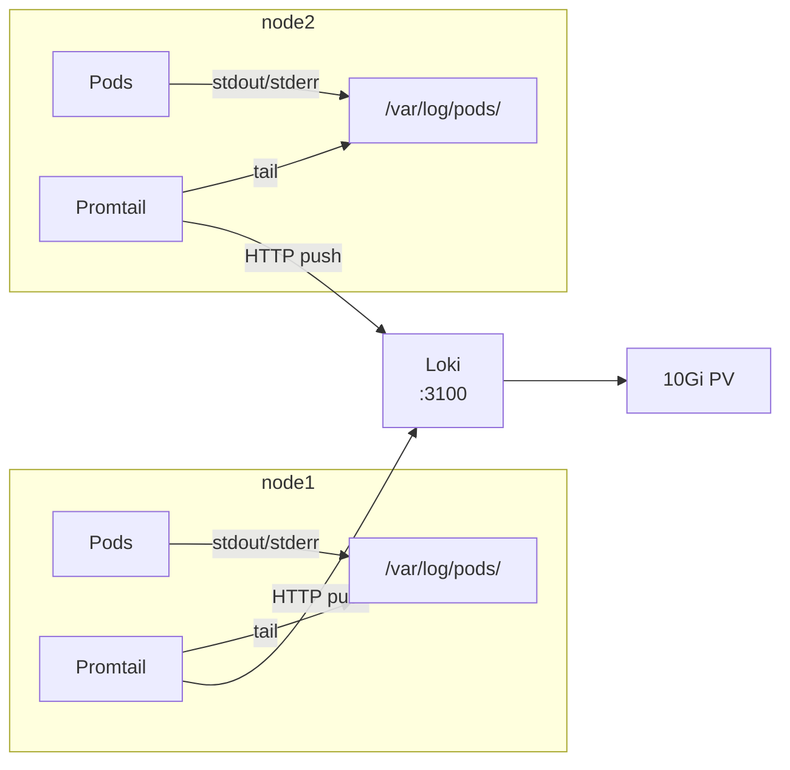
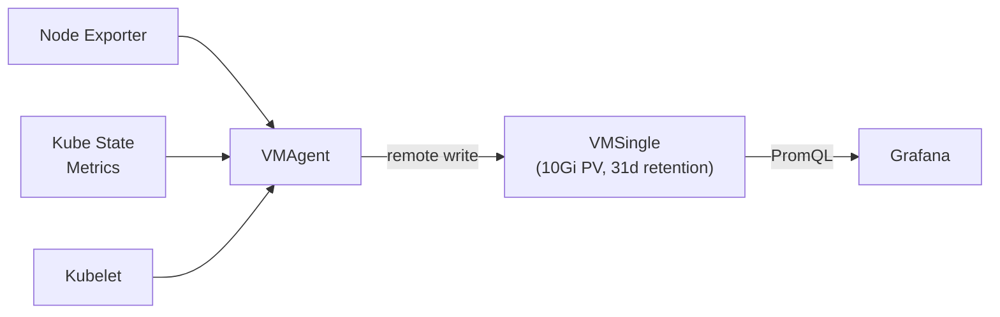

The platform runs a full observability stack for log aggregation and metrics collection, accessible at <a href="https://monitoring.kevinryan.io" target="_blank" rel="noopener noreferrer">monitoring.kevinryan.io</a>. All components are deployed as Flux CD HelmReleases in the `observability` namespace and scheduled exclusively on the dedicated agent node (node2).

## Stack Overview



## Components

| Component | Chart | Version Range | Purpose |
|-----------|-------|---------------|---------|
| **Grafana** | `grafana` (community) | `>=11.0.0 <12.0.0` | Dashboard UI and query engine |
| **Loki** | `loki` (grafana) | `>=6.0.0 <7.0.0` | Log aggregation and storage |
| **Promtail** | `promtail` (grafana) | `>=6.0.0 <7.0.0` | Log collection agent (DaemonSet) |
| **VictoriaMetrics** | `victoria-metrics-k8s-stack` | `>=0.70.0 <1.0.0` | Metrics collection, storage, and alerting rules |

All charts are pinned to semver ranges and reconciled hourly by Flux. Install and upgrade failures retry up to 5 times automatically.

### Helm Repositories

Three HelmRepository resources provide chart sources:

| Repository | URL | Charts |
|------------|-----|--------|
| `grafana` | `https://grafana.github.io/helm-charts` | Loki, Promtail |
| `grafana-community` | `https://grafana-community.github.io/helm-charts` | Grafana |
| `victoriametrics` | `https://victoriametrics.github.io/helm-charts/` | victoria-metrics-k8s-stack |

## Node Scheduling

All observability workloads are isolated on node2 using Kubernetes taints and node selectors. Node2 is configured at K3s install time with:

```bash
--node-taint observability=true:NoSchedule --node-label role=observability
```

Every HelmRelease values block includes:

```yaml
nodeSelector:
  role: observability
tolerations:
  - key: observability
    operator: Equal
    value: "true"
    effect: NoSchedule
```

This ensures site workloads on node1 and observability workloads on node2 never compete for resources. The only exception is Promtail, which runs as a DaemonSet on both nodes to collect logs from all pods.

## Grafana

Grafana provides the dashboard interface at `monitoring.kevinryan.io`.

### Configuration

| Setting | Value |
|---------|-------|
| Replicas | 1 |
| Root URL | `https://monitoring.kevinryan.io` |
| Login form | Enabled |
| Sign-up | Disabled |
| Service | ClusterIP on port 80 |

### Database

Grafana stores its state (dashboards, users, preferences) in the `grafana_db` PostgreSQL database on the Azure Flexible Server. Database credentials are sourced from Azure Key Vault via an ExternalSecret:

```yaml
apiVersion: external-secrets.io/v1
kind: ExternalSecret
metadata:
  name: grafana-db
  namespace: observability
spec:
  refreshInterval: 1h
  secretStoreRef:
    kind: ClusterSecretStore
    name: azure-keyvault
  target:
    name: grafana-db
    template:
      data:
        GF_DATABASE_TYPE: "postgres"
        GF_DATABASE_HOST: "{{ .pg_fqdn }}:5432"
        GF_DATABASE_NAME: "grafana_db"
        GF_DATABASE_USER: "{{ .pg_admin_username }}"
        GF_DATABASE_PASSWORD: "{{ .pg_admin_password }}"
        GF_DATABASE_SSL_MODE: "require"
        GF_SECURITY_ADMIN_PASSWORD: "{{ .grafana_admin_password }}"
        admin-user: "admin"
```

The admin password is also stored in this secret, keeping all Grafana credentials in a single Kubernetes secret managed by the External Secrets Operator.

### Datasources

Grafana is pre-configured with two datasources:

| Datasource | Type | Internal URL | Default |
|------------|------|-------------|---------|
| **Loki** | `loki` | `http://loki.observability.svc.cluster.local:3100` | Yes |
| **VictoriaMetrics** | `prometheus` | `http://vmsingle-vm.observability.svc.cluster.local:8428` | No |

VictoriaMetrics uses the `prometheus` datasource type because it is fully compatible with the Prometheus query API (PromQL).

### Dashboard Sidecar

Grafana runs a sidecar container that watches for ConfigMaps with the label `grafana_dashboard: "1"` in the `observability` namespace. Any ConfigMap with this label is automatically loaded as a Grafana dashboard — no manual import required.

### Ingress

```yaml
apiVersion: traefik.io/v1alpha1
kind: IngressRoute
metadata:
  name: grafana
  namespace: observability
spec:
  entryPoints:
    - websecure
  routes:
    - match: Host(`monitoring.kevinryan.io`)
      kind: Rule
      services:
        - name: grafana
          port: 80
  tls: {}
```

## Loki

Loki is the log aggregation engine. It receives logs from Promtail, indexes them, and serves queries to Grafana.

### Deployment Mode

Loki runs in **SingleBinary** mode — all components (ingester, querier, compactor) run in a single process. This is the simplest deployment topology, appropriate for the platform's log volume. All distributed-mode components are explicitly disabled:

```yaml
deploymentMode: SingleBinary
singleBinary:
  replicas: 1
backend:
  replicas: 0
read:
  replicas: 0
write:
  replicas: 0
# ... all other components set to 0
```

### Storage

| Setting | Value |
|---------|-------|
| Storage type | Filesystem (local-path PV) |
| Volume size | 10Gi |
| Schema | TSDB v13 |
| Index period | 24 hours |
| Retention | 744 hours (31 days) |

Loki stores both index and chunk data on a persistent volume provisioned by the K3s local-path storage provisioner. No object store (S3, MinIO) is required.

### Disabled Features

To keep the deployment minimal, several optional components are turned off:

| Component | Why Disabled |
|-----------|-------------|
| Gateway | Not needed — Promtail pushes directly to Loki |
| MinIO | Filesystem storage is used instead |
| Chunks/Results cache | Single-binary mode handles caching internally |
| Loki Canary | Synthetic log testing not needed at this scale |
| Bloom filters | Advanced query optimisation not needed |

## Promtail

Promtail is the log collection agent. It runs as a DaemonSet on every node in the cluster, tailing container logs from the node's filesystem and pushing them to Loki.

### Configuration

```yaml
config:
  clients:
    - url: http://loki.observability.svc.cluster.local:3100/loki/api/v1/push
tolerations:
  - key: observability
    operator: Equal
    value: "true"
    effect: NoSchedule
```

The toleration is needed so Promtail can schedule on node2 (which has the `observability` taint). As a DaemonSet, it also runs on node1 without any additional configuration.

### Log Flow



Promtail automatically discovers pods, attaches Kubernetes labels (namespace, pod name, container name) to each log line, and pushes to Loki's HTTP API. Logs from all seven sites, Flux controllers, Umami, and the observability stack itself are collected.

### Log Format

The nginx containers across all sites emit JSON-formatted access logs:

```json
{
  "time": "2026-03-13T10:00:00+00:00",
  "remote_addr": "10.0.1.1",
  "request": "GET / HTTP/1.1",
  "status": 200,
  "body_bytes_sent": 4523,
  "request_time": "0.001",
  "http_user_agent": "Mozilla/5.0 ..."
}
```

This structured format enables Loki LogQL queries to extract fields for filtering and aggregation in Grafana dashboards.

## VictoriaMetrics

VictoriaMetrics provides metrics collection and storage as a lightweight, Prometheus-compatible alternative. It is deployed via the `victoria-metrics-k8s-stack` chart, which bundles multiple components.

### Enabled Components

| Component | Role |
|-----------|------|
| **VictoriaMetrics Operator** | Manages VMSingle, VMAgent, and scrape configs |
| **VMSingle** | Single-node metrics storage (Prometheus-compatible TSDB) |
| **VMAgent** | Metrics scraper (replaces Prometheus server for scraping) |
| **Node Exporter** | Exposes host-level metrics (CPU, memory, disk, network) |
| **Kube State Metrics** | Exposes Kubernetes object metrics (pod status, deployment replicas, etc.) |
| **Kubelet** | Kubelet metrics collection |

### Disabled Components

| Component | Why Disabled |
|-----------|-------------|
| Grafana | Deployed separately with its own HelmRelease |
| Alertmanager | No alerting configured |
| VMAlert | No alerting rules active |
| VMAuth | No multi-tenant authentication needed |
| VMCluster | Single-node mode (VMSingle) is sufficient |
| kubeControllerManager, kubeScheduler, kubeEtcd, kubeProxy | Not accessible in K3s (embedded in the K3s binary) |

### Storage

| Setting | Value |
|---------|-------|
| Retention | 31 days |
| Volume | 10Gi PersistentVolumeClaim (ReadWriteOnce) |
| Scrape interval | 30 seconds |

### Prometheus Converter

The VictoriaMetrics Operator's Prometheus converter is enabled (`disable_prometheus_converter: false`). This means any `ServiceMonitor` or `PodMonitor` CRDs in the cluster are automatically converted to VictoriaMetrics scrape configs — maintaining compatibility with the Prometheus ecosystem.

### Metrics Flow



## Custom Dashboards

Two custom Grafana dashboards are deployed as ConfigMaps with the `grafana_dashboard: "1"` label, automatically loaded by the Grafana sidecar.

### Flux CD Dashboard

| Panel | Type | Data |
|-------|------|------|
| Reconciliation Activity | Time series (stacked bars) | Count of reconciliation events per controller |
| Flux Errors and Warnings | Time series (line) | Count of error/warn/failed events per controller |
| Reconciliation Events | Logs | Filtered log stream showing reconcile, apply, create, delete, drift, error events |
| All Flux Logs | Logs | Unfiltered log stream from Flux controllers |

Includes a `$controller` template variable to filter by kustomize-controller, helm-controller, or source-controller.

### Platform Overview Dashboard

| Panel | Type | Data |
|-------|------|------|
| Log Volume by Namespace | Time series (stacked bars) | Count of log lines per namespace over time |
| Error Rate | Time series (line, red) | Total count of error/fatal/panic log lines |
| Error Rate by Namespace | Time series (line) | Error count broken down by namespace |
| Recent Errors | Logs | Filtered log stream showing only error/fatal/panic entries |

Includes a `$namespace` template variable (dynamically populated from Loki labels) to filter by any namespace in the cluster.

## Secrets

Grafana credentials are managed via the External Secrets Operator. Four Key Vault secrets are composed into the `grafana-db` Kubernetes secret:

| Key Vault Secret | Kubernetes Key | Purpose |
|-----------------|----------------|---------|
| `pg-fqdn` | `GF_DATABASE_HOST` | PostgreSQL server address |
| `pg-admin-username` | `GF_DATABASE_USER` | Database login |
| `pg-admin-password` | `GF_DATABASE_PASSWORD` | Database password |
| `grafana-admin-password` | `GF_SECURITY_ADMIN_PASSWORD` | Grafana admin UI password |

Secrets refresh hourly. Loki, Promtail, and VictoriaMetrics do not require external secrets — they have no credentials or external state.

## Flux CD Integration

The observability Kustomization depends on the External Secrets store being available:

```yaml
apiVersion: kustomize.toolkit.fluxcd.io/v1
kind: Kustomization
metadata:
  name: observability
  namespace: flux-system
spec:
  dependsOn:
    - name: external-secrets-store
  interval: 10m0s
  path: ./k8s/observability
  prune: true
  sourceRef:
    kind: GitRepository
    name: flux-system
```

This ensures the `ClusterSecretStore` is ready before Grafana's `ExternalSecret` is created.

## DNS

The `monitoring.kevinryan.io` A record is managed by Terraform in the root module:

```hcl
resource "cloudflare_record" "monitoring" {
  zone_id = var.cloudflare_zone_id
  name    = "monitoring"
  content = module.network.public_ip_address
  type    = "A"
  proxied = true
  ttl     = 1
}
```

Traffic is proxied through Cloudflare, providing CDN caching for static dashboard assets and DDoS protection for the Grafana API.

## Manifest Inventory

All 12 files in `k8s/observability/`:

| File | Resource Type | Purpose |
|------|--------------|---------|
| `namespace.yaml` | Namespace | `observability` namespace |
| `helmrepository-grafana.yaml` | HelmRepository | Loki + Promtail charts |
| `helmrepository-grafana-community.yaml` | HelmRepository | Grafana chart |
| `helmrepository-victoriametrics.yaml` | HelmRepository | VictoriaMetrics chart |
| `helmrelease-grafana.yaml` | HelmRelease | Grafana deployment |
| `helmrelease-loki.yaml` | HelmRelease | Loki deployment |
| `helmrelease-promtail.yaml` | HelmRelease | Promtail DaemonSet |
| `helmrelease-victoria-metrics.yaml` | HelmRelease | VictoriaMetrics stack |
| `externalsecret.yaml` | ExternalSecret | Grafana DB + admin credentials |
| `ingress.yaml` | IngressRoute | `monitoring.kevinryan.io` routing |
| `dashboard-flux-cd.yaml` | ConfigMap | Flux CD Grafana dashboard |
| `dashboard-platform-overview.yaml` | ConfigMap | Platform overview Grafana dashboard |
