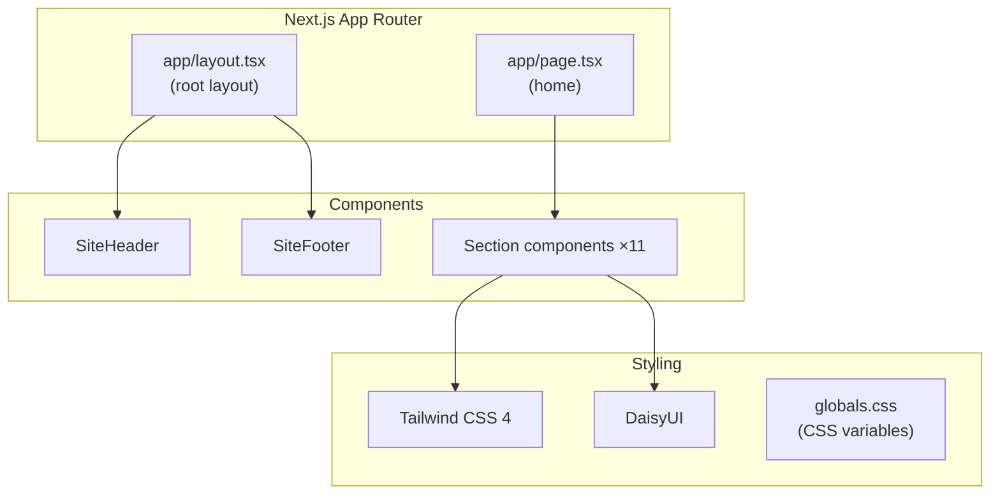

The portfolio site at <a href="https://kevinryan.io" target="_blank" rel="noopener noreferrer">kevinryan.io</a> is the primary web property for Kevin Ryan. It is a statically exported Next.js application served by nginx.

## Stack

| Technology | Version | Role |
|------------|---------|------|
| Next.js | 16.1.4 | React framework (App Router, static export) |
| React | 19.2.3 | UI library |
| TypeScript | ^5 | Type safety (strict mode) |
| Tailwind CSS | ^4 | Utility-first styling |
| DaisyUI | ^5.5.14 | Tailwind component library |
| PostCSS | ^8.5.6 | CSS processing |
| Fitty | ^2.4.2 | Responsive text fitting |
| ESLint | ^9 | Linting (with eslint-config-next) |

## Architecture



## Configuration

### Next.js (`next.config.ts`)

| Setting | Value | Purpose |
|---------|-------|---------|
| `output` | `'export'` | Static HTML export (no Node.js runtime) |
| `images.unoptimized` | `true` | Required for static export |
| `trailingSlash` | `true` | Consistent URL paths |
| `reactStrictMode` | `true` | React development checks |
| `NEXT_PUBLIC_COMMIT_SHA` | From env or `'dev'` | Version display in footer |

### TypeScript (`tsconfig.json`)

- Strict mode enabled
- Target: ES2017
- Module resolution: bundler
- Path alias: `@/*` maps to project root

## Application Structure

```text
sites/kevinryan-io/
├── app/
│   ├── layout.tsx              # Root layout (fonts, analytics, header)
│   ├── page.tsx                # Home page (section composition)
│   └── globals.css             # Tailwind imports + CSS variables
├── components/
│   ├── SiteHeader.tsx          # Fixed navigation with mobile menu
│   ├── SiteFooter.tsx          # Footer with commit SHA
│   ├── BookCover.tsx           # Book cover component
│   └── sections/
│       ├── HeroSection.tsx
│       ├── TickerBar.tsx
│       ├── DocsBanner.tsx
│       ├── AboutSection.tsx
│       ├── CapabilitiesSection.tsx
│       ├── DeliverySection.tsx
│       ├── ClientsSection.tsx
│       ├── TimelineSection.tsx
│       ├── WritingSection.tsx
│       ├── CertificationsSection.tsx
│       └── ContactSection.tsx
├── hooks/
│   └── useRevealOnScroll.ts    # IntersectionObserver for scroll animations
├── lib/
│   └── constants.ts            # Layout constants (container config)
├── public/                     # Static assets (images, favicons)
├── Dockerfile
├── nginx.conf
├── next.config.ts
├── tsconfig.json
├── postcss.config.mjs
├── eslint.config.mjs
└── package.json
```

## Page Architecture

### Home Page

The home page is a composition of section components rendered in sequence. Each section is a standalone component in `components/sections/`:

1. **HeroSection** — full-viewport hero with name, title, and animated text (Fitty)
1. **TickerBar** — scrolling ticker with key phrases
1. **DocsBanner** — link to documentation site
1. **AboutSection** — professional summary
1. **CapabilitiesSection** — skill areas
1. **DeliverySection** — delivery methodology
1. **ClientsSection** — client logos and names
1. **TimelineSection** — career timeline
1. **WritingSection** — published works
1. **CertificationsSection** — professional certifications
1. **ContactSection** — contact details

## Styling

### Tailwind CSS 4

Tailwind is imported via the new v4 CSS-first configuration:

```css
@import "tailwindcss";
```

PostCSS processes Tailwind via `@tailwindcss/postcss`. Custom CSS variables define the brand colour palette and typography scale in `globals.css`.

### Fonts

Five Google Fonts are loaded in the root layout:

| Font | Weight(s) | Usage |
|------|-----------|-------|
| Archivo | 400–900 | Primary body text |
| Bebas Neue | 400 | Display headings |
| Work Sans | 300, 900 | Accent text |
| DM Sans | 300–700 | Secondary body text |
| JetBrains Mono | 400–700 | Code and monospace |

### DaisyUI

DaisyUI provides pre-built Tailwind components (buttons, cards, navigation). It is installed as a dev dependency and integrated via the Tailwind plugin system.

## Client-Side Patterns

### Scroll Reveal

The `useRevealOnScroll` hook uses the `IntersectionObserver` API to add a `.revealed` class to elements with the `.reveal` class when they enter the viewport. This drives CSS-based entrance animations without a third-party animation library.

### Responsive Text (Fitty)

The `fitty` library dynamically scales text to fill its container width. It is used in the hero section for responsive headline sizing that adapts to any viewport width.

### Static Export

The site uses `output: 'export'` in Next.js, which generates a fully static site at build time. There are no API routes, no server components with runtime data fetching, and no middleware. The output directory (`out/`) contains only HTML, CSS, JavaScript, and static assets.

## Build and Serve

The site uses a multi-stage Docker build:

1. **Build stage** — Node.js 22 Alpine with pnpm runs `next build`, producing static files in `out/`
1. **Serve stage** — nginx 1.28.2 Alpine serves the static output on port 8080

The `COMMIT_SHA` build argument is exposed as `NEXT_PUBLIC_COMMIT_SHA`, making the git commit hash available in the client bundle for version identification in the footer.

### nginx Configuration

- JSON structured access logs (consumed by Promtail/Loki)
- Gzip compression for HTML, CSS, JS, JSON, and SVG
- Long-lived cache headers for `/_next/static/` (immutable hashed assets)
- No-cache headers for HTML files (ensures fresh content)
- `/healthz` endpoint for Kubernetes health probes
- Security headers: `X-Content-Type-Options`, `X-Frame-Options`, `Referrer-Policy`
- `try_files` fallback: `$uri` → `$uri.html` → `$uri/index.html` → `/404.html`
